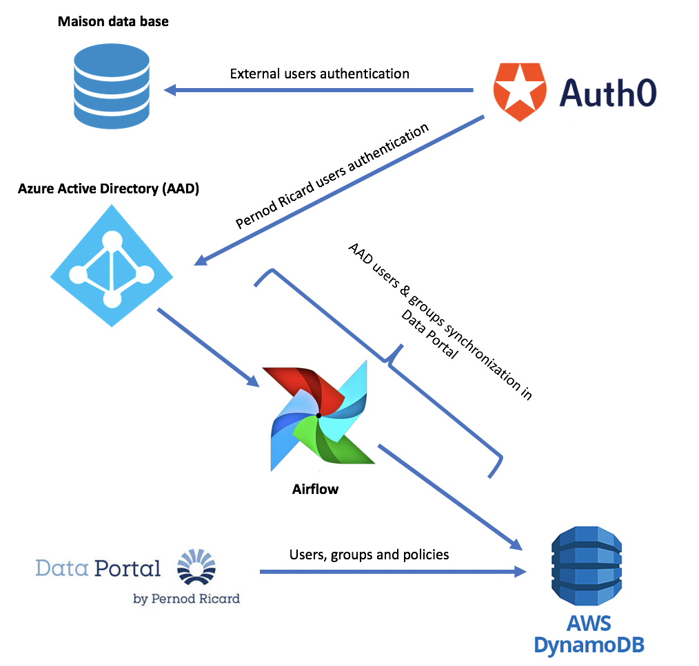

# Data Portal users and groups synchronization with Azure Active Directory 

This Airflow DAG aims to synchronize the users and groups in Azure active directory with Data Portal database. 

## Overview: 

## 

### Groups processing: 

- Getting all groups from Azure Active Directory: "groups_ad" and all groups from Data Portal data base :"groups_dp_ad"
  - **ADD** *groups_ad – groups_dp_ad* **TO** groups_dp_ad
  - **DELETE**  *groups_dp_ad – groups_ad* **FROM** groups_dp_ad 

### Users processing: 

- Getting all users from Azure Active Directory "users_ad" in the scope (users in group_id ="cf97c7b0-ede3-468d-8537-a535236420fb") and all users from dataportal users:  users_dp_ad 
  - **ADD** *users_ad – users_dp_ad* TO users_dp_ad 
  - **FOR** each user **IN** users_ad **AND IN** users_dp_ad **IF** *user["dp_groups"] - user["native_groups"] != users["new_ad_groups"]* **UPDATE** *user["dp_groups"] = user["native_groups"] + user["new_ad_groups"]*
